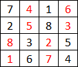

# PyMagicSquares (4x4 Custom Sum Magic Square Generator)

This Python package generates **4x4 magic squares** with a **custom target sum** using a modular algorithm based on two disjoint value sets and structural masks.

## ✨ Features

* Guaranteed magic sum in **rows and columns**
* Fully customizable to **any target sum**
* Structural magic: consistent symmetry and quadrant-based properties
* Based on **two disjoint sets (A and B)**, each with 8 values
* Includes base value and binary masks for consistent value placement

---

## 🔧 Algorithm Capabilities

### 1. ✅ Guaranteed and Rich Magic Properties

Each generated 4x4 magic square satisfies the following for a given sum $M$:

* All **rows** and **columns** sum to $M$
* Each **2x2 quadrant** sums to $M$
* The **four corners** sum to $M$
* The **center 2x2 block** sums to $M$
* Any set of **non-corner opposing edge cells** (4-cell symmetric pairs) sum to $M$:

  * E.g., (0,1)+(1,0)+(2,3)+(3,2)
  * E.g., (0,2)+(1,3)+(2,0)+(3,1)
* Any **sub-diagonal 2x2 square** (like an 'X' shifted) also sums to $M$

This is a result of the inherent balance and symmetry enforced by the masks.

### 2. ♻️ Generalizable to Any Target Sum

You can control the total sum by shifting values in **A** and **B**:

$$
M = 2 \times \text{avg}(A) + 2 \times \text{avg}(B)
$$

Each row and column contains exactly 2 numbers from **A** and 2 from **B**.

### 3. 🌟 Modular Construction

* Uses a fixed **base value mask** (1–8) to ensure each value appears twice
* A binary **A/B mask** defines position of values from set A or B

This creates a flexible, reliable mapping framework.

### 4. ♻️ Linear Transformability

* A and B can be shifted by constants to generate related squares
* Scaling can produce new families (with caution)

### 5. 📊 Combinatorially Rich

* Number of valid squares for a given sum $M$ is a function of:

  * Number of 8-element subsets of integers summing to $a$
  * Disjoint 8-element subsets of integers summing to $2M - a$

This allows combinatorial exploration and efficient enumeration.

### 6. 🧰 Extendable Framework

* Useful in:

  * Cryptographic masking / symmetric patterning
  * Latin-magic hybrids
  * Educational tools for symmetry and linear algebra
  * Puzzle generation (e.g., symmetric Sudoku variants)

---

## 📚 Example Output

Given:

```python
A = [1,2,3,4,5,6,7,8]
B = [477,478,479,480,481,482,483,484]  # Target M: 970
```

Generated Magic Square:

```
[  7, 480,   1, 482]
[  2, 481,   8, 479]
[484,   3, 478,   5]
[477,   6, 483,   4]
```

Each row/column sums to 970, with all the advanced symmetries preserved.

---

## 🔧 Installation

To include this as a module:

```bash
pip install magicsquare2 
``` 

---

## ⚙️ Usage
Here, k is one of 8 possible orientations (see sources). 
M is the target sum, and low is the lowest value in the 
grid. The value 'low' cannot be higher than M/4. M cannot 
be lower than 72 (since we're dealing with two sets of 
numbers between 1-8 as the base case).

```python
from magicsquare2 import generate_grid

square = generate_grid(k, M, low)
print(square)
```

Here, a word about k, or the base grid. The algorithm 
starts with the following base grid. (Note that sets A 
and B are colored in alternate colours.)




Based on this grid, seven more rotations and mirror 
images are possible. They are best explored via examples. 

---

## 📄 License

GNU GENERAL PUBLIC LICENSE Version 3

---

## 🚀 Future Work

* Support for 5x5 or NxN variants

---

## 🛍† Feedback

Pull requests, issues, and feature suggestions welcome!
